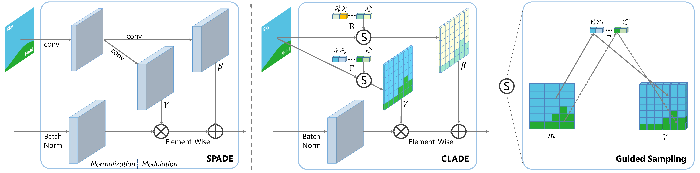

# Semantic Image Synthesis via Efficient Class-Adaptive Normalization

### [Paper](https://arxiv.org/pdf/2012.04644.pdf)

[Zhentao Tan](https://scholar.google.com/citations?user=VCX7itEAAAAJ&hl=zh-CN&oi=ao), [Dongdong Chen](http://www.dongdongchen.bid/), [Qi Chu](https://scholar.google.com/citations?user=JZjOMdsAAAAJ&hl=en), [Menglei Chai](https://mlchai.com/), [Jing Liao](https://liaojing.github.io/html/index.html), [Mingming He](http://mingminghe.com/),  Lu Yuan, [Gang Hua](https://scholar.google.com/citations?user=7SgUlggAAAAJ&hl=zh-CN&oi=ao), [Nenghai Yu](https://scholar.google.com/citations?user=7620QAMAAAAJ&hl=zh-CN)

## Abstract
Spatially-adaptive normalization [SPADE](https://github.com/NVlabs/SPADE.git) is remarkably successful recently in conditional semantic image synthesis, which modulates the normalized activation with spatially-varying transformations learned from semantic layouts, to prevent the semantic information from being washed away. Despite its impressive performance, a more thorough understanding of the advantages inside the box is still highly demanded to help reduce the significant computation and parameter overhead introduced by this novel structure. In this paper, from a return-on-investment point of view, we conduct an in-depth analysis of the effectiveness of this spatially-adaptive normalization and observe that its modulation parameters benefit more from semantic-awareness rather than spatial-adaptiveness, especially for high-resolution input masks. Inspired by this observation, we propose class-adaptive normalization (CLADE), a lightweight but equally-effective variant that is only adaptive to semantic class. In order to further improve spatial-adaptiveness, we introduce intra-class positional map encoding calculated from semantic layouts to modulate the normalization parameters of CLADE and propose a truly spatially-adaptive variant of CLADE, namely CLADE-ICPE. %Benefiting from this design, CLADE greatly reduces the computation cost while being able to preserve the semantic information in the generation. Through extensive experiments on multiple challenging datasets, we demonstrate that the proposed CLADE can be generalized to different SPADE-based methods while achieving comparable generation quality compared to SPADE, but it is much more efficient with fewer extra parameters and lower computational cost.

## Installation

Clone this repo.
```bash
git clone https://github.com/tzt101/CLADE.git
cd CLADE/
```

This code requires PyTorch 1.6 and python 3+. Please install dependencies by
```bash
pip install -r requirements.txt
```

## Dataset Preparation

The Cityscapes, COCO-Stuff and ADE20K dataset can be download and prepared following [SPADE](https://github.com/NVlabs/SPADE.git). We provide the ADE20K-outdoor dataset selected by ourselves in [OneDrive](https://mailustceducn-my.sharepoint.com/:u:/g/personal/tzt_mail_ustc_edu_cn/ERJWBXyAZW1FrJ0sXWQxm0cBjdqN3kgJXOtSuqRBTSktUw?e=fHuPrV).

To make the distance mask which called intra-class positional encoding map in the paper, you can use the following commands:
```bash
python cal_dist_masks.py --path [Path_to_dataset] --dataset [ade20k | coco | cityscapes]
```
By default, the distance mask is normalized. If you do not want it, please set `--norm no`.

# Generating Images Using Pretrained Model

Once the dataset is ready, the result images can be generated using pretrained models.

1. Download the pretrained models from the [OneDrive](https://mailustceducn-my.sharepoint.com/:u:/g/personal/tzt_mail_ustc_edu_cn/EU8LC9ElEmRIqpe__0GrD0gBRDKERkK6q-J-oI9k8GxHGA?e=tQ6zk4), save it in `checkpoints/`. The structure is as follows:
```bash
./checkpoints/
    ade20k/
        best_net_G.pth
    ade20k_dist/
        best_net_G.pth
    ade20k_outdoor/
        best_net_G.pth
    ade20k_outdoor_dist/
        best_net_G.pth
    cityscapes/
        best_net_G.pth
    cityscapes_dist/
        best_net_G.pth
    coco/
        best_net_G.pth
    coco_dist/
        best_net_G.pth
```
`_dist` means that the model use the additional positional encoding, called CLADE-ICPE in the paper.

2. Generate the images on the test dataset.
```bash
python test.py --name [model_name] --norm_mode clade --batchSize 1 --gpu_ids 0 --which_epoch best --dataset_mode [dataset] --dataroot [Path_to_dataset]
```
`[model_name]` is the directory name of the checkpoint file downloaded in Step 1, such as `ade20k` and `coco`. `[dataset]` can be on of `ade20k`, `ade20koutdoor`, `cityscapes` and `coco`. `[Path_to_dataset]` is the path to the dataset. If you want to test CALDE-ICPE, the command is as follows:
```bash
python test.py --name [model_name] --norm_mode clade --batchSize 1 --gpu_ids 0 --which_epoch best --dataset_mode [dataset] --dataroot [Path_to_dataset] --add_dist
```

## Training New Models

You can train your own model with the following command:
```bash
# To train CLADE and CLADE-ICPE.
python train.py --name [experiment_name] --dataset_mode [dataset] --dataroot [Path_to_dataset]
python train.py --name [experiment_name] --dataset_mode [dataset] --dataroot [Path_to_dataset] --add_dist
```
If you want to test the model during the training step, please set `--train_eval`. By default, the model every 10 epoch will be test in terms of FID. Finally, the model with best FID score will be saved as `best_net_G.pth`.

## Calculate FID 

We provide the code to calculate the FID which is based on [rpo](https://github.com/mseitzer/pytorch-fid.git). We have pre-calculated the distribution of real images (all images are resized to 256×256 except cityscapes is 512×256) in training set of each dataset and saved them in `./datasets/train_mu_si/`. You can run the following command:
```bash
python fid_score.py [Path_to_real_image] [Path_to_fake_image] --batch-size 1 --gpu 0 --load_np_name [dataset] --resize [Size]
```
The provided `[dataset]` are: `ade20k`, `ade20koutdoor`, `cityscapes` and `coco`. You can save the new dataset by replacing `--load_np_name [dataset]` with `--save_np_name [dataset]`.

## New Useful Options 

The new options are as follows:
- `--use_amp`: if specified, use AMP training mode.
- `--train_eval`: if sepcified, evaluate the model during training.
- `--eval_dims`: the default setting is 2048, Dimensionality of Inception features to use.
- `--eval_epoch_freq`: the default setting is 10, frequency of calculate fid score at the end of epochs.

## Code Structure

- `train.py`, `test.py`: the entry point for training and testing.
- `trainers/pix2pix_trainer.py`: harnesses and reports the progress of training.
- `models/pix2pix_model.py`: creates the networks, and compute the losses
- `models/networks/`: defines the architecture of all models
- `options/`: creates option lists using `argparse` package. More individuals are dynamically added in other files as well. Please see the section below.
- `data/`: defines the class for loading images and label maps.

## Citation
If you use this code for your research, please cite our papers.
```
@article{tan2020rethinking,
  title={Rethinking Spatially-Adaptive Normalization},
  author={Tan, Zhentao and Chen, Dongdong and Chu, Qi and Chai, Menglei and Liao, Jing and He, Mingming and Yuan, Lu and Yu, Nenghai},
  journal={arXiv preprint arXiv:2004.02867},
  year={2020}
}
@article{tan2020semantic,
  title={Semantic Image Synthesis via Efficient Class-Adaptive Normalization},
  author={Tan, Zhentao and Chen, Dongdong and Chu, Qi and Chai, Menglei and Liao, Jing and He, Mingming and Yuan, Lu and Gang Hua and Yu, Nenghai},
  journal={arXiv preprint arXiv:2012.04644},
  year={2020}
}
```

## Acknowledgments
This code borrows heavily from [SPADE](https://github.com/NVlabs/SPADE.git). 

